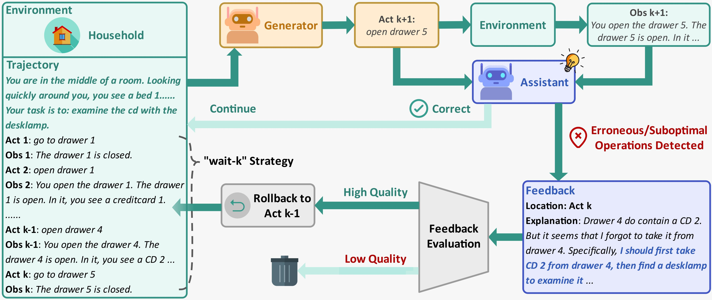

# Generator-Assistant Stepwise Rollback Framework for Large Language Model Agent



Code for paper [Generator-Assistant Stepwise Rollback Framework for Large Language Model Agent](https://arxiv.org/abs/2503.02519)

## ⚙️ Setup

### Environment

You can install the required packages by running the following command:

```shell
conda create -n rollback python=3.9
conda activate rollback
pip install -r requirements.txt
```

_Remember to change the pytorch version according to your CUDA._

### Tasks

➕ [Game of 24](https://github.com/princeton-nlp/tree-of-thought-llm)  
We made slight modifications to make sure the environment can return observations based on each action.(```./test_game24/game24.py```)

🧹 [ALFWorld](https://github.com/alfworld/alfworld)  
You can directly use package ```alfworld``` or ```git clone https://github.com/alfworld/alfworld.git alfworld``` to ```./test_alfworld/alfworld```.  
__Download data for ALFWorld:__  

```shell
alfworld-download
```

The game files will be stored in ```~/.cache/alfworld/```. __Or you want to download to a specific path:__

```shell
cd test_alfworld/alfworld
gdown https://drive.google.com/uc?id=1y7Vqeo0_xm9d3I07vZaP6qbPFtyuJ6kI
unzip alfworld_data.zip
```

When testing ALFWorld, first use ```export ALFWORLD_DATA=<storage_path>``` to specify the path.

🛒 [WebShop](https://github.com/princeton-nlp/WebShop/tree/master)  

```shell
cd ./test_webshop
git clone https://github.com/princeton-nlp/webshop.git webshop
cd ./webshop
bash setup.sh -d all
```

You can comment out ```get_human_trajs()``` in ```setup.sh```.  
Change ```web_agent_site/utils.py``` to load all products:

```python
# DEFAULT_ATTR_PATH = join(BASE_DIR, '../data/items_ins_v2_1000.json')
# DEFAULT_FILE_PATH = join(BASE_DIR, '../data/items_shuffle_1000.json')
DEFAULT_ATTR_PATH = join(BASE_DIR, '../data/items_ins_v2.json') # all
DEFAULT_FILE_PATH = join(BASE_DIR, '../data/items_shuffle.json') # all
```

Change the url and port in ```./web_agent_site/app.py```.  
Launch your webpage:

```shell
bash run_dev.sh
```

The site should be viewable on [http://your_url:your_port](http://your_url:your_port).

_Please refer to corresponding repositories for more information._

## ⚡ Quickstart

### Game of 24

```shell
cd ./test_game24
python g24_rollback.py \
        --num_samples 500 \   # num of sampled test instances
        --seed 42 \           # seed used to shuffle the test set
        --model_source open \ # open / close (open sourced/api-based llms)
        --max_roll_num 6 \    # the maximum num of rollbacks allowed (to prevent infinite loops)
        --llm_name_or_path your_model_path \    # model used as generator
        --force_same_LM 1 \   # force the generator and assistant to use the same model
        --assist_name_or_path your_model_path \ # model used as assistant
        --mode 'act'          # act / raect
```

### ALFWorld

```shell
cd ./test_alfworld
export ALFWORLD_DATA=<storage_path>
python alf_rollback.py \
        --model_source open \ # open / close (open sourced/api-based llms)
        --max_roll_num 6 \    # the maximum num of rollbacks allowed (to prevent infinite loops)
        --llm_name_or_path your_model_path \    # model used as generator
        --force_same_LM 1 \   # force the generator and assistant to use the same model
        --assist_name_or_path your_model_path \ # model used as assistant
        --out_record_path log_path \            # log path
        --wait_k 6 \          # num of "wait-k"
        --mode 'act'          # act / raect
```

### WebShop

_Launch the website first._

```shell
cd ./test_webshop
python web_rollback.py \
        --port your_port \      # port
        --model_source 'open' \ # open / close (open sourced/api-based llms)
        --max_roll_num 6 \      # the maximum num of rollbacks allowed (to prevent infinite loops)
        --sample_num 500 \      # num of sampled test instances
        --llm_name_or_path your_model_path \    # model used as generator
        --force_same_LM 1 \     # force the generator and assistant to use the same model
        --assist_name_or_path your_model_path \ # model used as assistant
        --out_record_path log_path              # log path
```

___Feel free to apply the method to other tasks.___

## 🔗 Citation

If you find this work useful, please cite:

```bibtex
@article{li2025generator,
  title={Generator-Assistant Stepwise Rollback Framework for Large Language Model Agent},
  author={Li, Xingzuo and Chen, Kehai and Long, Yunfei and Bai, Xuefeng and Xu, Yong and Zhang, Min},
  journal={arXiv preprint arXiv:2503.02519},
  year={2025}
}
```
